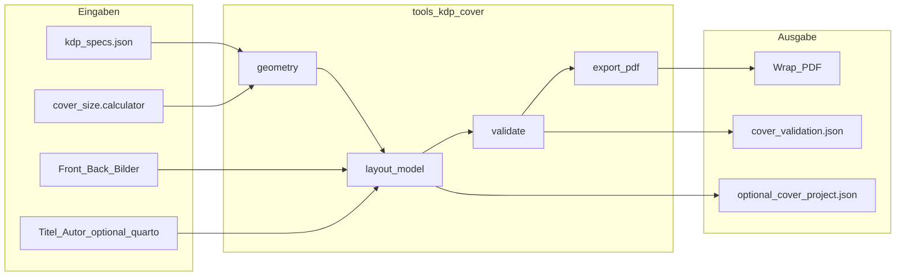

# Konzept: KDP Wrap-Cover-Designer (autonomes Tool)

Status: **Phase 1–4 umgesetzt — Branch `Amazon_KDP`.**
Phase 1: Geometrie + Validierung + CLI-Export (`tools/kdp_cover/`).
Phase 2: Plugin + Dialog (Assistent, Vorschau, Ampel, Export).
Phase 3: Frei-Modus-Offsets, `cover_project.json` speichern/laden/autoload,
zweistufige Export-Bestätigung.
Phase 4: Launcher Asset Manager + Markdown-Editor (dünne Einstiege).
Entstanden 2026-08-03 aus der Klärung: KDP verlangt ein **separates**
Cover-PDF (Rückseite + Rücken + Vorderseite inkl. Bleed); das bestehende
`content/Deckblatt.md` ist eine **Innenwerk-Schmuckseite**, kein Upload-Cover.

## Ziel

Ein geführter, aber erweiterbarer Designer, der ein **KDP-konformes
Wrap-PDF** erzeugt und als Upload-Artefakt neben dem Innenwerk-PDF
abliegt — ohne `Deckblatt.md` zu ändern oder die Typst-Render-Pipeline
anzufassen.

## Ausgangslage (Ist)

Aktuelles IFJN-Deckblatt (`production/books/IFJN_Brustkrebs/content/Deckblatt.md`):

- YAML `print_title: false`, Typst `#page(margin: 0pt)` mit
  `#image("/img/Deckblatt_IFJN_Brustkrebs.png", … fit: "cover")`
- Ergebnis: erste **Innenseite** des Buch-PDFs (Vollbild)
- Für KDP-Taschenbuch **nicht** als Cover-Upload geeignet

Bereits vorhanden und wiederverwendbar (nur lesen / aufrufen):

| Baustein | Rolle |
|---|---|
| `kdp_specs.json` + `tools/kdp_specs.py` | Bleed, Trim, Papierarten (SSOT) |
| `tools/cover_size/` | Rückenbreite + Gesamt-Wrap-Maße |
| Plugin `cover_size` | Reiner Rechner, kein Datei-Export |
| `tools/asset_manager/` | Bildpool / `img/` — potenzieller Launcher |
| Autonomie-Muster | `.doc/ebook-epub-autonomes-tool.md`, `plugins/cover_size` |

## Nicht-Ziele

- Keine Änderung an `Deckblatt.md` / Innenwerk-Struktur (bewusst entkoppelt)
- Kein Ersatz für KDPs Online-Cover-Creator (wir erzeugen Print-Ready-PDF lokal)
- Keine Anbindung an `export_manager.py` / Quarto-Render des Buches
- Kein Canva-Klon in v1 (kein freies Vektor-Zeichnen, keine Cloud)

## Verbindliche Architektur-Regeln (wie eBook-Konzept)

1. **Vollständig autonomes Tool** unter `tools/kdp_cover/` — gesamte
   Domänenlogik, Layout-Modell, Validierung, PDF-Export leben dort.
2. **Keine Gefahr für bestehende Funktionalität** — kein Import aus
   `export_manager`, `services/` (außer ggf. spätere dünne Hooks), keine
   Änderung an Render/Typst.
3. **Keine Aufblähung der Haupt-App** — Kernpfad bleibt unberührt;
   Einstieg nur über Plugin-Discovery (+ optionale dünne Launch-Buttons).

Empfohlenes Muster (wie Cover-Größe / Publisher-Compliance):

```
tools/kdp_cover/          ← SSOT-Logik (kein Qt-Zwang im Kern)
  model.py                ← Wrap-Layout-Datenmodell (JSON-serialisierbar)
  geometry.py             ← Maße aus cover_size / kdp_specs
  validate.py             ← KDP-Regeln (Bleed, Safe Zone, DPI, Rücken-Text)
  export_pdf.py           ← Wrap-PDF erzeugen (ReportLab / Pillow+PDF)
  templates/              ← optionale Presets (einfarbig, Bild-Front, …)
  cli.py                  ← headless Export für Tests/CI
plugins/kdp_cover/        ← dünner Adapter + plugin.json (Menü Plugins)
ui_qt/dialogs/kdp_cover_dialog.py   ← Qt-UI (nur Präsentation)
```

`tools/kdp_cover` darf `tools.kdp_specs` und `tools.cover_size.calculator`
**lesen/aufrufen** (bereits SSOT). Es darf **nicht** in
`export_manager` / `quarto_render_safe` schreiben oder von dort
aufgerufen werden müssen.

## Produktentscheidungen (festgelegt)

| Frage | Entscheidung |
|---|---|
| Output | **Wrap-PDF** (Back + Spine + Front inkl. Bleed), separates Artefakt |
| Bezug zu Deckblatt.md | **unabhängig** — kein Schreiben in Content |
| Freiheit vs. Sicherheit | **Zwei Modi** (siehe unten) |
| Einstieg (Empfehlung) | **Primär C** (Plugin unter Plugins), **B und A als dünne Launch-Buttons** später |

### Freiheit + Idiotensicher: Zwei-Modi-Modell

Widerspruch auflösen durch klare Default-Schiene und expliziten Expertenmodus:

**Modus „Sicher“ (Default)**

- Assistent in Schritten: Trim → Papier → Seitenzahl → Front-Bild →
  optional Back-Bild/Farbe → Titel/Autor (auto aus `_quarto.yml` lesbar) →
  Vorschau mit Overlays → Export nur wenn Validierung grün
- Safe-Zone (typ. 0,25″ / ~6,4 mm innen von Trim), Bleed-Rand, Rücken-
  Mittellinie als **nicht abschaltbare** Hilfslinien in der Vorschau
- Titel/Autor/Barcode-Zone: vordefinierte Text-Slots; Verschieben nur
  innerhalb Safe-Zone
- Rücken-Text automatisch **deaktiviert** bei &lt; 79 Seiten (KDP-Regel)
- Export-Button gesperrt bei Errors; Warnings müssen per Checkbox
  bestätigt werden („Ich habe die Warnung gelesen“)

**Modus „Frei“ (Experten)**

- Elemente frei positionieren/skalieren auf dem Wrap-Canvas
- Eigene Schriften/Farben; Overlays nur noch Hinweise, nicht blockierend
- Export trotz Warnings möglich — aber nur nach **zweistufiger** Bestätigung
  und mit sichtbarem Validierungsbericht im Export-Ordner
  (`cover_validation.json` neben dem PDF)
- Umschalten Sicher→Frei: kurzer Hinweisdialog (kein Verstecken hinter Menü)

So bleibt der Normalweg idiotensicher; maximale Freiheit ist erreichbar,
ohne den Default zu verwässern.

## Einstiegspunkte A / B / C

Alle drei rufen dieselbe Tool-API auf
(`tools.kdp_cover` + Dialog). Logik lebt nur einmal.

| Option | Ort | Aufwand Kern-App | Empfehlung |
|---|---|---|---|
| **C** | Plugin-Menü „KDP Cover-Designer…“ | null (Auto-Discovery) | **v1-Pflicht** |
| **B** | Button im Asset Manager | 1 Zeile Launch im Asset-Manager-Dialog | **v1.1**, passt thematisch (Cover-Bilder) |
| **A** | Button im MD-Editor bei geöffnetem Deckblatt | Toolbar-Hook in `text_dialogs.py` | **optional / später** — irreführend, weil Deckblatt ≠ Wrap; nur wenn Label klar „KDP-Wrap (separat)“ |

v1 liefert **C**. B und A sind reine Launcher ohne eigene Logik.

## Datenfluss



### Speicherorte (Vorschlag)

Pro Buchprojekt, **außerhalb** von `content/`:

```
<book>/export/kdp_cover/
  Cover-Wrap_<trim>_<pages>_<timestamp>.pdf
  cover_validation.json
  cover_project.json          # editierbarer Zwischenstand
```

Optional Kopie der verwendeten Front/Back-Assets unter
`export/kdp_cover/assets/` (keine Pflicht, Referenzen auf `img/` möglich).

`publish_map` / Mapping Manager: später optional einen Render-Typ
„kdp_cover“ listen — **nicht** v1, kein Kernzwang.

## Validierungsregeln (Kern von „idiotensicher“)

Mindestens prüfen vor Export (Errors blockieren Sicher-Modus):

1. Canvas-Maße = `2×trim_w + spine + 2×bleed` × `trim_h + 2×bleed`
   (über `cover_size` / `kdp_specs.bleed_mm`)
2. Bilder ≥ 300 DPI bezogen auf Druckgröße im jeweiligen Panel
3. Kein kritischer Text in Bleed- oder Barcode-Zone (Barcode-Zone:
   Platzhalter-Rechteck Rückseite unten rechts gemäß KDP-Doku)
4. Rücken-Text nur wenn Seitenzahl ≥ 79; sonst Error im Sicher-Modus
5. Trim/Papier/Seitenzahl im gültigen KDP-Bereich (`kdp_specs.paperback`)
6. PDF ohne Crop-Marks, ohne Transparenz-Schichten die KDP stören
   (flatten wo nötig)

Warnings (bestätigbar): niedriger Kontrast Text/Hintergrund, Front-Bild
nicht randabfallend, fehlendes Back-Bild (einfarbige Fläche ok).

## UI-Skizze (Dialog)

1. **Parameter-Leiste:** Trim (Presets + Studio-Paperback 135×215), Papier,
   Seitenzahl (Vorschlag aus letztem Render / manuell), Modus Sicher|Frei
2. **Canvas:** horizontales Wrap (Back | Spine | Front), Maßstab, Toggle
   Overlays (Bleed / Trim / Safe / Barcode / Spine-Mitte)
3. **Inspector:** gewähltes Element (Bild, Textfeld); im Sicher-Modus
   nur erlaubte Eigenschaften
4. **Fußzeile:** Validierungsstatus (Ampel) + „PDF exportieren…“

Abhängigkeiten GUI: PySide6 (bereits), Bildverarbeitung Pillow (prüfen ob
schon in `requirements.txt`), PDF: ReportLab **oder** Typst-Einzelseiten-
Template nur innerhalb `tools/kdp_cover` (kein Quarto-Buch-Render).
Entscheidung bei Umsetzung: Prefer **Pillow-Compose → PDF** oder
**ReportLab**, damit kein Quarto für Cover nötig ist.

## Phasen

### Phase 0 — Konzept & Branch (jetzt)

- Branch `Amazon_KDP`
- Dieses Dokument
- Abnahme der Produktentscheidungen

### Phase 1 — Geometrie + CLI-Export (ohne großen Designer)

- `tools/kdp_cover/geometry.py` + Anbindung `cover_size`
- Minimales Layout: Front-Bild full-bleed Front-Panel, Back einfarbig oder
  Bild, optional Spine-Farbe, Titel auf Front in Safe-Slot
- `export_pdf` + `validate` + Pytest gegen feste Maßtabelle
- CLI: `python -m tools.kdp_cover …`

### Phase 2 — Plugin + Sicher-Modus-Dialog ✅

- `plugins/kdp_cover/` + `ui_qt/dialogs/kdp_cover_dialog.py`
- Assistent + Canvas-Vorschau + Ampel-Validierung
- Export nach `export/kdp_cover/` (+ `_project.json` / `_validation.json`)

### Phase 3 — Frei-Modus + Persistenz ✅

- Freie Textplatzierung (mm-Offsets + Titel-Skalierung), nur im Modus ``free``
- `cover_project.json` speichern/laden; Autoload aus
  `<Buch>/export/kdp_cover/cover_project.json`
- Zweistufige Warning-Bestätigung (Checkbox) beim Frei-Export
- Wechsel Sicher→Frei mit Hinweisdialog; Sicher setzt Offsets zurück

### Phase 4 — Launcher B (Asset Manager) + A (MD-Editor) ✅

- Asset Manager: Footer-Button „KDP-Wrap…“ → `open_kdp_cover_qt`
- Markdown-Editor: Toolbar „Cover → KDP-Wrap…“ mit Tooltip
  „KDP-Wrap (separat)“ / unabhängig von Deckblatt.md
- Beide Launcher ohne eigene Logik (nur Dialog-Aufruf)

### Phase 5 — KDP-Kanal-Flag + Cover-Bindung ✅

- SSOT: `bookconfig/distribution.json` (`channels.kdp_paperback`) via
  `tools/distribution/book_store.py`
- Bindungsstatus: `tools/kdp_cover/binding.py` → `off` / `ready` / `missing`
  am kanonischen Pfad `export/kdp_cover/cover_project.json`
- Designer: Banner „Buch & KDP-Kanal“, Checkbox, Statuszeile;
  Buttons „Zwischenstand speichern/laden…“
- Buch-Doktor: Warning wenn Flag an und Zwischenstand fehlt
- Kein Auto-Anlegen einer leeren `cover_project.json` beim Setzen des Flags

## Abgrenzung zu bestehenden Tools

| Tool | Bleibt | Beziehung |
|---|---|---|
| Cover-Größe berechnen | ja | liefert Maße; Designer **nutzt** es, ersetzt es nicht |
| KDP-Spezifikationen | ja | SSOT für Bleed/Trim/Papier |
| Druck-Freigabe prüfen | ja | prüft **Innenwerk**-PDF; Cover-PDF hat eigene Validierung im Designer |
| Asset Manager | ja | Bildquelle + späterer Launcher |
| Deckblatt.md | unverändert | Innenwerk-Preview, nicht Teil dieses Tools |

## Offene Punkte (klein, bei Umsetzung klären)

- Exakte Barcode-Zonenmaße aus aktueller KDP-Cover-Hilfe gegenprüfen und
  ggf. in `kdp_specs.json` ergänzen (`cover.barcode_zone_…`)
- Ob Studio-Trim 135×215 mm als Default vorausgewählt wird, wenn
  Layout-Profil `paperback` / `taschenbuch-bod` aktiv ist
- PDF-Bibliothek (ReportLab vs. img2pdf/Pillow) — nach Dependency-Check

## Quellen

- KDP: Taschenbuchcover erstellen — https://kdp.amazon.com/de_DE/help/topic/G201953020
- KDP: Format, Beschnitt, Ränder — https://kdp.amazon.com/de_DE/help/topic/GVBQ3CMEQW3W2VL6
- Intern: `.doc/ebook-epub-autonomes-tool.md`, `.doc/publisher-compliance-konzept.md`
- Intern: `tools/cover_size/`, `kdp_specs.json`
